# GNR 638 Assignment-1

This is the submission for GNR638 Assignment 1,2

### Group members

- Akash Sansugu Palaniswami (21D171001)
- Rahul B (22B3976)

# Assignment 1
## Overview
In this project we made use of an existing github repo using tiny images and bag of sift features, along with nearest neighbor and SVM classifiers to perform classification. We used the UCMerced Land Use dataset which contained 2100 images of 21 different categories. Images were divided as 70% for training, 20% for testing and 10% for validation. The size of vocabulary was varied in bag of sifts to find the one with maximum accuracy

## Steps to run code

```bash
python proj3.py  -- feature tiny_image --classifier nearest_neighbor
```

Change the feature to either tiny_image or bag_of_sift and classifier to either `nearest_neighbor` or `support_vector_machine` as required 

## Results
### Confusion Matrix and Accuracy for Tiny Images with Nearest Neighbor Classifier
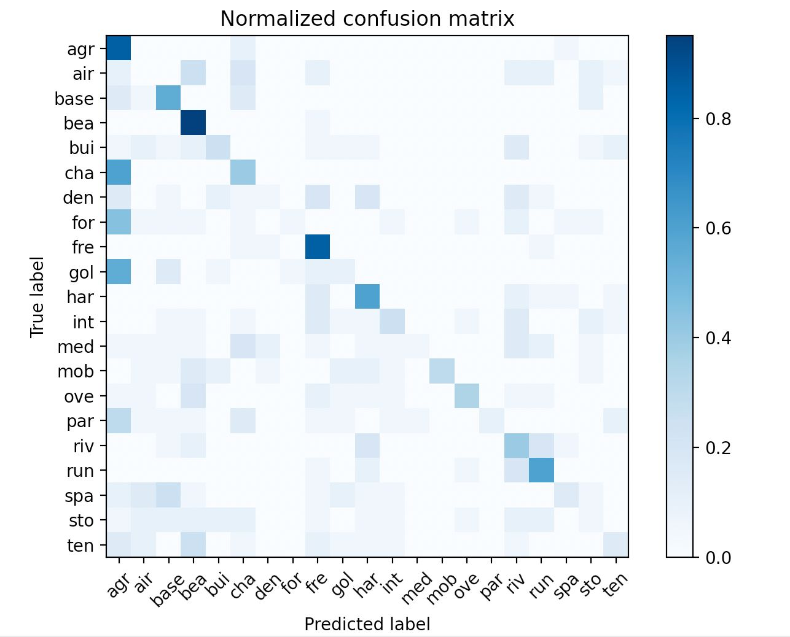
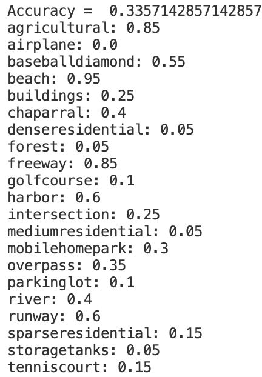

### Confusion Matrix and Accuracy for Bag of Sift with Nearest Neighbor Classifier
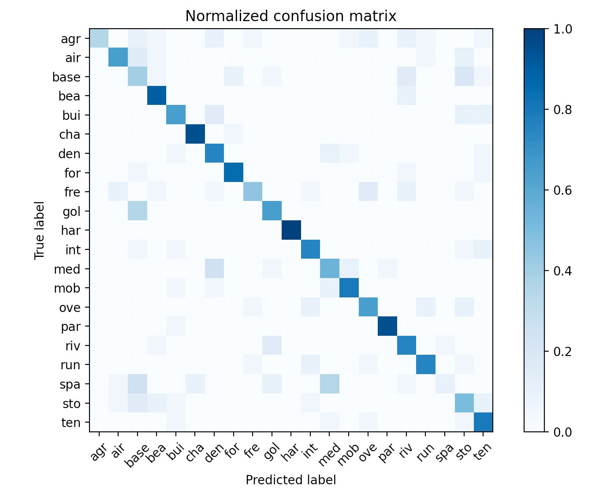
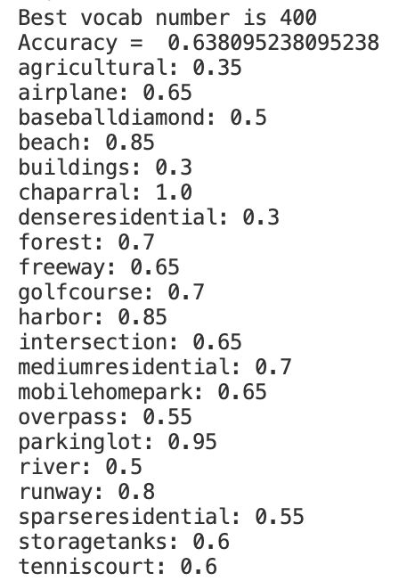

### Confusion Matrix and Accuracy for Bag of Sift with SVM Classifier
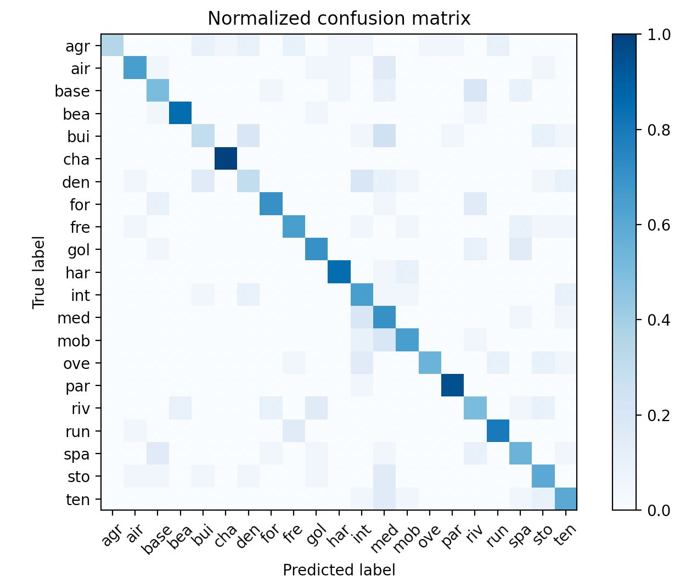
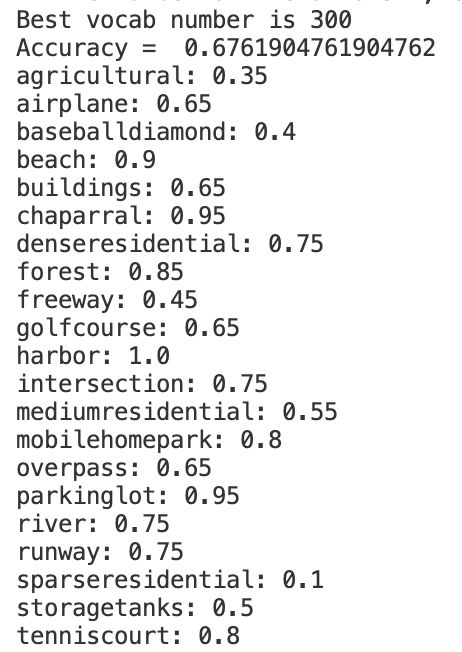

### Variation of Accuracy with Change in Vocabulary size
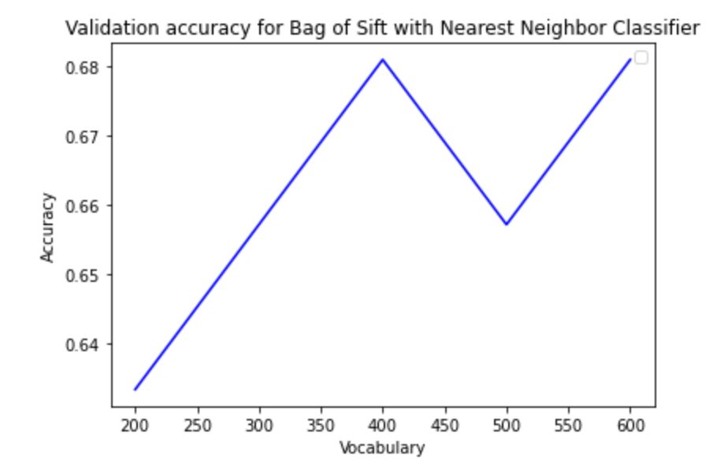


### t-SNE Visualisation
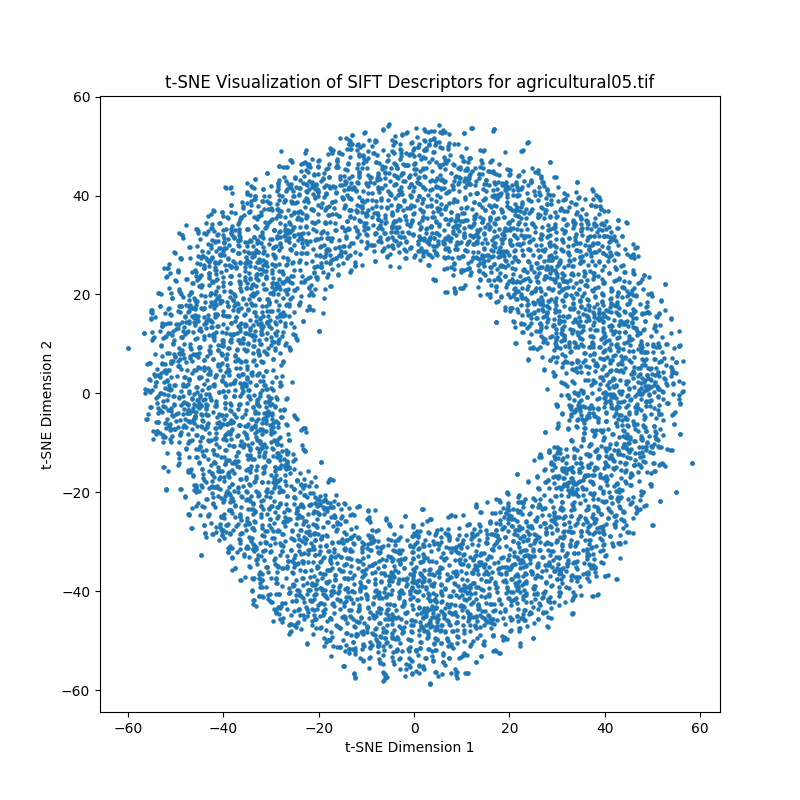
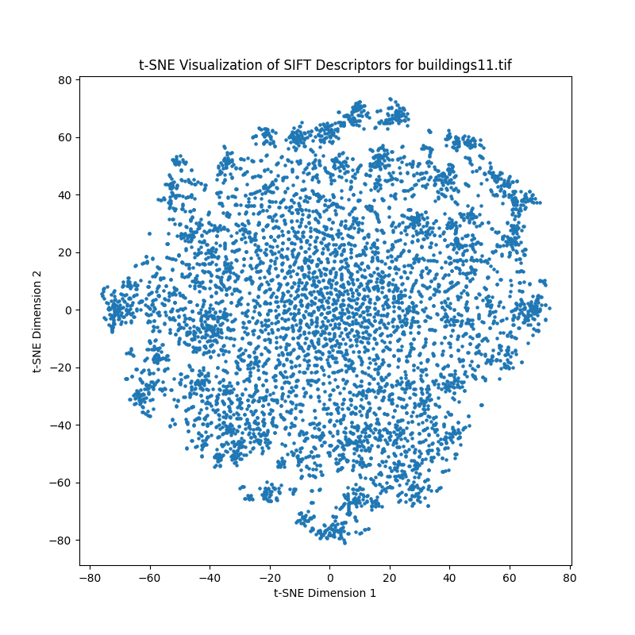
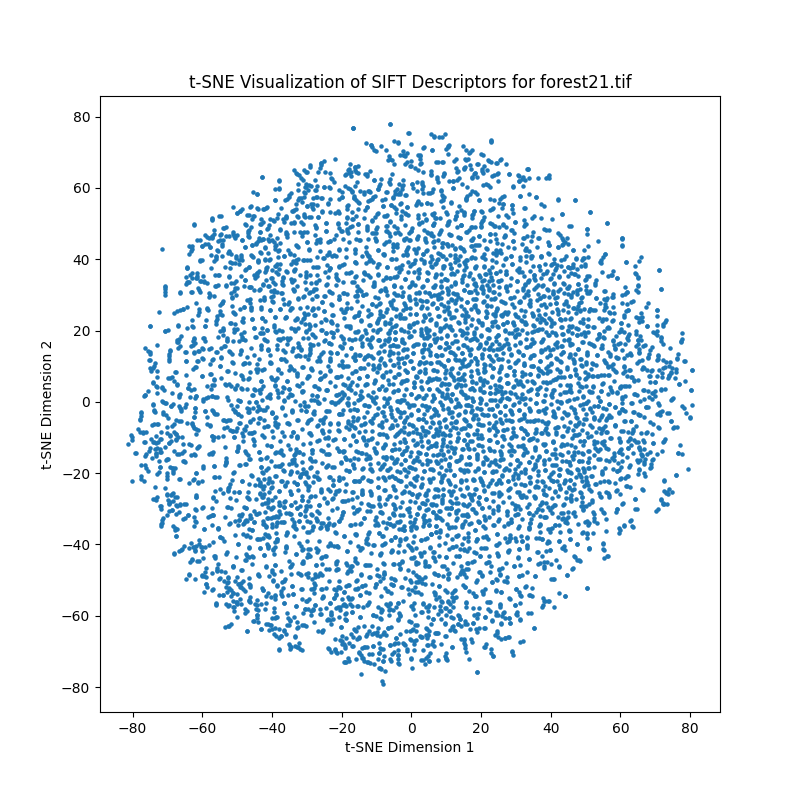
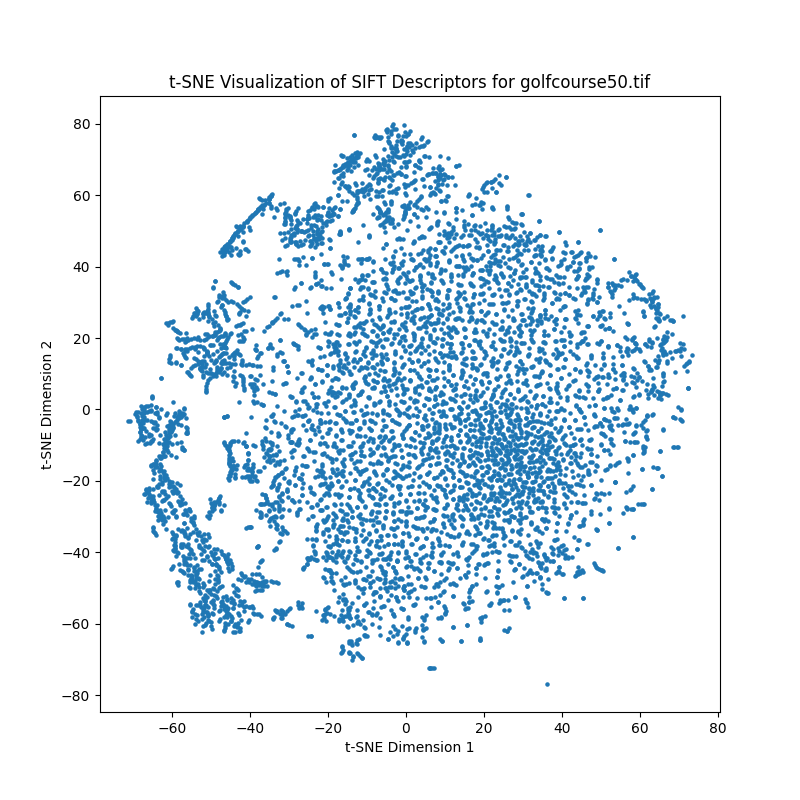
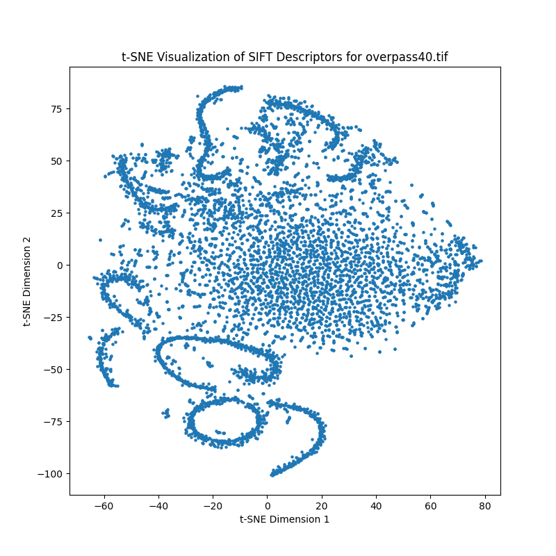
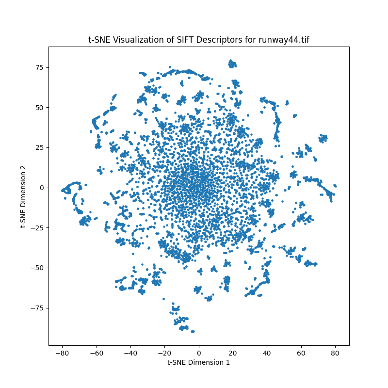


# Assignment 2
## Overview
The goal of this assignment was to use the UCMerced Land dataset for classification problems, using a multi layered perceptron. In the first part we used the features from bag of sift, while in the second we resized the images to 72 by 72 then linearised it and used it as features. The MLP used contains 2 hidden layers which we vary in size

## Part 1
File mlp_test.py is to be run for this part. The features used were taken as the same features that were obtained from bag of sift in the first assignment. Vocab size of 600 was used as logically the higher amount of features should give us better results. MLP models are to be tested for the following pairs of hidden layer values: [(512, 256), (256,128), (1024,512), (2048,1024)]. The different activation functions tested are: ['relu','tanh','linear','sigmoid']
This gives us a total of 16 different combinations to test, to determine which gives the best output using validation. A cross vaidation technique was used to determine which of the above combinations proved to be best. The accuracy came out to be between 60-70% for most of them. When running this code, an input as --classifier mlp should be given along with the run command. 

## Results


