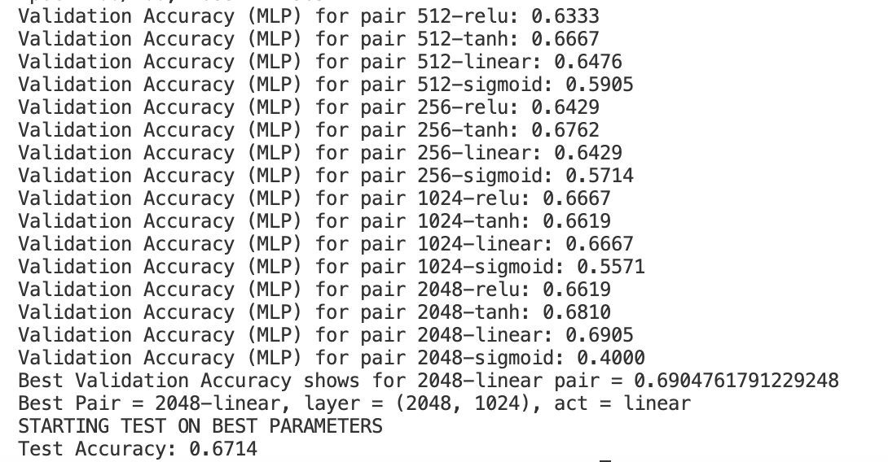
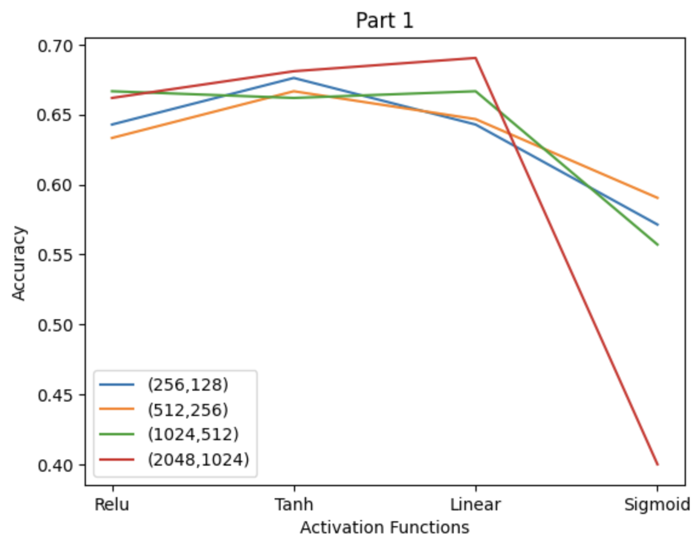
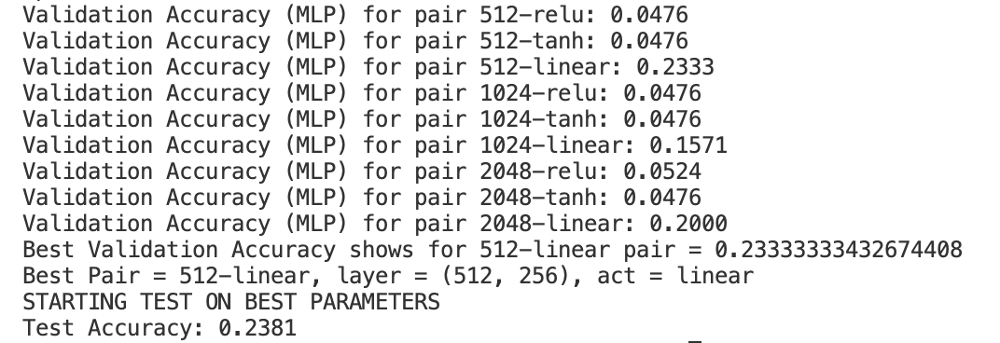

# GNR 638 Assignment-1,2

This is the submission for GNR638 Assignment 1,2

### Group members

- Akash Sansugu Palaniswami (21D171001)


# Assignment 1
## Overview
In this project we made use of an existing github repo using tiny images and bag of sift features, along with nearest neighbor and SVM classifiers to perform classification. We used the UCMerced Land Use dataset which contained 2100 images of 21 different categories. Images were divided as 70% for training, 20% for testing and 10% for validation. The size of vocabulary was varied in bag of sifts to find the one with maximum accuracy

## Steps to run code

```bash
python proj3.py  -- feature tiny_image --classifier nearest_neighbor
```

Change the feature to either tiny_image or bag_of_sift and classifier to either `nearest_neighbor` or `support_vector_machine` as required 

## Results
### Confusion Matrix and Accuracy for Tiny Images with Nearest Neighbor Classifier


### Confusion Matrix and Accuracy for Bag of Sift with Nearest Neighbor Classifier


### Confusion Matrix and Accuracy for Bag of Sift with SVM Classifier


### Variation of Accuracy with Change in Vocabulary size


### t-SNE Visualisation


# Assignment 2
## Overview
The goal of this assignment was to use the UCMerced Land dataset for classification problems, using a multi layered perceptron. In the first part we used the features from bag of sift, while in the second we resized the images to 72 by 72 then linearised it and used it as features. The MLP used contains 2 hidden layers which we vary in size

## Part 1
File mlp_test.py is to be run for this part. The features used were taken as the same features that were obtained from bag of sift in the first assignment. Vocab size of 600 was used as logically the higher amount of features should give us better results. MLP models are to be tested for the following pairs of hidden layer values: [(512, 256), (256,128), (1024,512), (2048,1024)]. The different activation functions tested are: ['relu','tanh','linear','sigmoid']
This gives us a total of 16 different combinations to test, to determine which gives the best output using validation. A cross vaidation technique was used to determine which of the above combinations proved to be best. The accuracy came out to be between 60-70% for most of them. When running this code, an input as --classifier mlp should be given along with the run command. 
```bash
python mlp_test.py --classifier mlp
```

### Important Parts of Code
We define a class called MLP in order to adjust and tamper with parameters such as activation and hidden layers of the model. Each activation function that we test on must be defined here
```bash
class MLP(nn.Module):
    def __init__(self, input_size, hidden_size1, hidden_size2, activation,num_classes=len(CATEGORIES)):
        super(MLP, self).__init__()
        self.fc1 = nn.Linear(input_size, hidden_size1)
        self.fc2 = nn.Linear(hidden_size1, hidden_size2)
        self.fc3 = nn.Linear(hidden_size2, num_classes)

        self.activation=activation 
        
        self.relu1 = nn.ReLU()
        self.relu2 = nn.ReLU()
        self.sigmoid1=nn.Sigmoid()
        self.sigmoid2=nn.Sigmoid()
        self.tanh1 = nn.Tanh()
        self.tanh2 = nn.Tanh()

    def forward(self, x):

        if(self.activation=='relu'):
            x = self.relu1(self.fc1(x))
            x = self.relu2(self.fc2(x))
            x = self.fc3(x)
        
        if(self.activation=='linear'):
            x = self.fc1(x)
            x = self.fc2(x)
            x = self.fc3(x)

        if(self.activation=='sigmoid'):
            x = self.sigmoid1(self.fc1(x))
            x = self.sigmoid1(self.fc2(x))
            x = self.fc3(x)
        
        if(self.activation == 'tanh'):
            x = self.tanh1(self.fc1(x))  # Apply tanh on first layer
            x = self.tanh2(self.fc2(x))  # Apply tanh on second layer
            x = self.fc3(x)

        return x
```
Train and crossvalidation functions are defined such that they are put in a for loop until all 16 combination of size and activation are tried. All features are transformed into tensors to be used in MLP 
```bash
train_feats = torch.tensor(train_feats, dtype=torch.float32)
    train_labels = torch.tensor(train_labels, dtype=torch.long)
   

    train_dataset = TensorDataset(train_feats, train_labels)
    train_loader = DataLoader(train_dataset, batch_size=32, shuffle=True)

    HiddenLayers=[(512, 256), (256,128), (1024,512), (2048,1024)]
    Activations=['relu','tanh','linear','sigmoid']

    for i in HiddenLayers:
        for j in Activations:
```
Model with best value of accuracy from cross validation is then used for testing

## Results


The best validation accuracy is shown for the maximum hidden layers, which is as expected and the activation function is linear. When tested with this same setup of the MLP we obtain an accuracy of 67.14%, which is around 2% less than what we achieved in validation. During training, the losses get to be very low, almost at 0 as we near 200 epochs, so the use of high epochs is justified.


As can be seen from the graph, it seems pretty clear that sigmoid function gives us the worst results. It can also be seen that in general a higher number of hidden layers leads to better results, which logically makes sense. It can also be seen that when the 2 hidden layers have 2048 and 1024 layers respectively, the accuracy seems to be the best, with the exception of sigmoid activaton function


## Part 2
File mlp_flatten.py is to be run for this part. Instead of taking bag of sift features, we take the given UCMerced data, resize it to a shape of (72,72), then flatten it in order to linearise it. This is taken as the features of each image, which is the input for the MLP. 
MLP models are to be tested for the following pairs of hidden layer values: [(512, 256) (1024,512), (2048,1024)]. The different activation functions tested are: ['relu','tanh','linear']. (256,128) and sigmoid function were removed from testing as we could see the poor results given by them in part 1 of the assignment, so it seems like a waste of time to test them again. A total of 9 combinations are to be tested.

### Important Parts of the code
File resize_linearise.py was created to contain the function resize_and_linearize_images which resized and flattened the given images.
```bash
def resize_and_linearize_images(image_paths, size=(72, 72)):
    """
    Resize images to the specified size and linearize them (flatten to 1D array).
    
    Parameters:
    - image_paths (list): List of paths to the images.
    - size (tuple): Target size to resize the images (default: 72x72).
    
    Returns:
    - resized_images (list): List of resized and linearized images.
    """
    resized_images = []
    
    for image_path in image_paths:
        # Open image
        image = Image.open(image_path)
        
        # Resize image to 72x72
        image_resized = image.resize(size)
        
        # Convert image to numpy array and flatten it
        image_array = np.array(image_resized)
        
        # Flatten the image (convert it into a 1D vector)
        linearized_image = image_array.flatten()
        
        resized_images.append(linearized_image)
    
    print('Done')
    
    return resized_images
```
Before converting all the features to tensors they were first transformed to numpy arrays to speeden the training process.
```bash
train_feats=np.array(train_feats)
train_feats = torch.tensor(train_feats, dtype=torch.float32)
train_labels = torch.tensor(train_labels, dtype=torch.long)
```
The remainder of the code more or less remains the same as part 1 which is mlp_test.py

## Results

Relu and Tanh seem to be giving the same accuracy all the time which is concerning as it is very low at 0.0476. These are not good activation functions to use for the given problem. Linear function gives us better reults at around 0.2 although not great.

 
 Linear functions is the only one that gives us decent results, and no pattern can be said by the hidden layer size, although (512, 256) which is the smallest size, gives us the best results.
 
Relu and Tanh both eventually come to a loss of 3 pretty quickly, within the first 10 epochs, and it stays the same for the remainder of the training. This indicates that there may not be much use in training and for this reason keeping 200 epochs might be too much and a waste of time and efficiency. On the other hand linear activation function causes high fluctuation in the losses, ranging in the hundreds quite often and sometimes even the thousands, and it never seems to settle down.

## Conclusion and Comparision
Bag of sift features with MLP is much better that resizing and linearising as the accuracy is more than triple in the first case. Not only did the second part not emit good results, but it also used up a lot of time in traaining when compared to the first one, which is just a waste of resources for poorer results. The MLP models which I created for each combination, was not able to be uploaded onto github as the file size was too big
